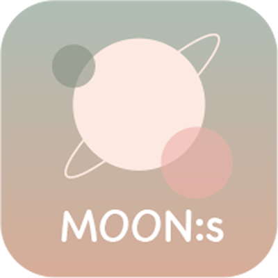

## <h1 height="30">MOON:s</h1> &nbsp;


_감성 필기구 브랜드 Moon:s의 앱을 소개하고, 필기구 관련 칼럼과 영상을 추천하는 웹 서비스_

<a href="https://spdhsrnvl123.github.io/Moons/">Website</a> | <a href='https://www.instagram.com/posepicker/'>notion</a> | <a href='https://online.fliphtml5.com/syfst/tnwo/#p=4'>디자인 발표 자료</a>
<br/>

## 🪄 Introduce

> #필기구 #브랜드 소개 #어플 소개 #다양한 컬럼과 영상 추천<br/>
> MOON:s 웹 사이트는 감성 필기구를 판매하는 브랜드와 앱을 소개하며 필기구에 관련된 다양한 컬럼과 영상을 추천한다. <br/>
> 
> 

<br/>


✨ <br/>
_Goal: 브랜드와 앱에 대한 정보를 보기 좋게 정리하여 사용자들이 MOON:s 브랜드에 더 많은 관심을 갖도록 하는 것이 목적이다._

<br/>

🎨 <br/>
_Design Concept: 일상의 순간을 기록하기 위한 필기구를 구매할 목적으로 가진 사용자들을 위해 쉽게 다가오고 편하게 볼 수 따듯한 색을 사용했고 편안하고 부드러운 이미지와 감성적인 손글씨체를 강조했다._

<br/>

## 📱 Feature


<br/>

## 🎞 Demo

[PosePicker Demo Video](https://youtube.com/shorts/dP7VdyoieMs?si=hv7ou7y1iZwkc7m3)

<br/>

## 🙌 Team

|                               Design                               |                                    FrontEnd                                    |                                    BackEnd                                    |
| :----------------------------------------------------------------: | :----------------------------------------------------------------------------: | :---------------------------------------------------------------------------: |
|  |  |  |
|                               이지영                               |                     [seondal](https://github.com/seondal)                      |                    [olive-su](https://github.com/olive-su)                    |
|   |   |  |
|                               김수빈                               |                     [guesung](https://github.com/guesung)                      |                    [leejw-lu](https://github.com/leejw-lu)                    |

<br/>

## 📚 Tech Stack

  

<br/>

## 📂 Folder Structure

> Next13의 App Rounting을 기반으로 하고있습니다.

```
├── public
│   ├── fonts
│   ├── icons
│   ├── images
│   ├── lotties
│   ├── manifest.json
│   └── pwa-icons
├── src
│   ├── apis
│   ├── app
│   │   ├── (Main)
│   │   │   ├── bookmark
│   │   │   ├── components
│   │   │   ├── feed
│   │   │   ├── layout.tsx
│   │   │   ├── pick
│   │   │   └── talk
│   │   ├── (Sub)
│   │   │   ├── bookmark
│   │   │   ├── detail
│   │   │   │   └── [id]
│   │   │   ├── layout.tsx
│   │   │   └── menu
│   ├── components
│   ├── constants
│   ├── hooks
│   ├── mock
│   ├── provider
│   ├── types
│   └── utils
├── styles
│   ├── theme
│   ├── font.css
│   └── typography.css
```


# Moon:s

## 🪄프로젝트 소개
> 감성 필기구 브랜드 Moon:s의 앱을 소개하고, 필기구 관련 칼럼과 영상을 추천하는 웹 서비스

## 배포 URL 및 발표자료
[Moon:s](https://spdhsrnvl123.github.io/Moons/)

[발표자료](https://online.fliphtml5.com/syfst/tnwo/)

## 개발 기간 및 팀 구성
2022.5.27 ~ 2022.6.19

Design - 3명
Front-end - 1명

## 사용 기술 스택
  

## 기능
- Carousel
- Scroll Event
- Animation
- Section Navigation move button

## 🎬 프로젝트 시연 영상
<table>
    <thead>
        <tr style="text-align:center">
            <td>메인페이지</td>
            <td>어바웃페이지</td>
        </tr>
    </thead>
    <tbody>
        <tr>
            <td>
</td>
            <td></td>
        </tr>
    </tbody>
        <thead >
        <tr style="text-align:center">
            <td>서비스페이지</td>
            <td>미디어페이지</td>
        </tr>
    </thead>
    <tbody>
        <tr> 
            <td></td>
            <td></td>
        </tr>
    </tbody>
</table>


